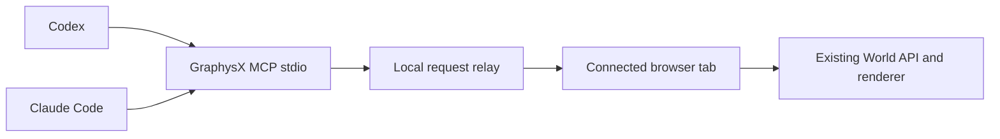

# GraphysX for Codex and Claude Code

Both clients use one local MCP adapter and the existing native World API. They can continue a connected browser world or prepare a separate editable scene without replacing the user's current tab. This does not need an AgentX model call.



There is one stdio process per client. Both address the same local relay and explicit browser connection IDs. The relay holds pending requests only; it does not mirror or store the world. The browser serializes delivery and checks the current revision before every mutation. Native validation, undo, storage and actor-attributed commits remain authoritative. Failed native operations are MCP errors, even when transport delivery succeeded. Uncertain dispatched timeouts are never retried automatically.

## Tools and context

| Tool | Purpose |
|---|---|
| `worlds` | Identify connected tabs, scene labels and revisions |
| `new_world` | Return a separate editor URL; the client opens it, then discovers its connection |
| `catalog` | Search the existing native tool catalogue on demand |
| `observe` | Compact summary, revision and at most24 entities |
| `read` | Native read-only methods, queried entities, assets, history and portable JSON |
| `edit` | Native mutating methods with a required observed revision |
| `camera` | Frame the actual main camera without changing scene content |
| `capture` | Return a PNG from the renderer after its current frame, including the face inset |

The full argument reference is exposed as the MCP resource `graphysx://world-api`, read only when needed. A short shared [skill](../skills/graphysx/SKILL.md) guides both clients. This avoids loading the full world JSON and every asset catalogue into every conversation turn.

## Local installation

The server is `tools/graphysx-mcp.mjs` (`npm run agent:mcp`). Its only new runtime packages are the official MIT MCP server SDK2.0.0 and Zod. They run locally and do not call a paid API.

Set `GRAPHYSX_URL` to a loopback origin such as `http://127.0.0.1:4207/`. With an existing build, the first `worlds`/`new_world` call starts the local preview if the port is absent; other calls do not blindly launch or replace servers. `LLMX_HOUSEHOLD_URL` is optional and only preserves the existing conversation route when starting that preview. Public/LAN origins, foreign Host/Origin headers and non-JSON mutations are rejected by the relay. Browser attachment is opt-in through `agentBridge=1`; ordinary/public GraphysX visits make no relay request.

Use the client's supported registration command with an absolute Node executable and script path:

```text
codex mcp add graphysx --env GRAPHYSX_URL=http://127.0.0.1:4207/ -- node /absolute/path/to/GraphysX-Web/tools/graphysx-mcp.mjs
claude mcp add --scope user --transport stdio graphysx -- node /absolute/path/to/GraphysX-Web/tools/graphysx-mcp.mjs
```

On Yanik's Windows installation, both configurations and both skill junctions currently reference `C:/Users/Yanik/codes/GraphysX-Web-llmx-integration`. Keep that checkout until the integration is merged and the registrations/junctions have been repointed. The shared skill source is `skills/graphysx`; installed paths are `~/.codex/skills/graphysx` and `~/.claude/skills/graphysx`. No tool approval policy was relaxed.

Existing sessions may need their MCP servers reloaded; no running Claude verification should be interrupted for this. Configuration follows the official [Codex MCP documentation](https://learn.chatgpt.com/docs/extend/mcp?surface=cli) and [Claude Code MCP documentation](https://code.claude.com/docs/en/mcp).

## Verification and limits

- Node tests cover two standard MCP client connections, discovery/resource reads, input schemas, browser read/edit separation, stale revisions, native rejection, bounded camera values, exact relay receipts, timeouts and local-origin restrictions.
- Actual normal-browser acceptance used two independent MCP protocol clients, with no model inference: both observed the existing Family Forge; a new editor tab was opened; client A created the base, client B added the top cube; a stale edit was rejected; native save/reload recovered the scene; camera and PNG capture returned inspected rendered pixels. This is transport/runtime proof, not a claim that a Claude or Codex model independently authored the demonstration.
- Codex registration is enabled; `claude mcp get graphysx` reports Connected. On-demand preview startup was separately exercised on a free local port, then that temporary process was stopped. The user's preview remains on4207.
- The new `agent-mcp` browser smoke is registered in the verification manifest. It and the earlier LLMx/standalone checks are queued behind Claude's full gate, per the user's explicit choice. Current queue session19766 supersedes the idle session46010. Logs will be `output/graphysx-agent-browser-verify.log` and `output/graphysx-agent-skill.log`; inspect them and their screenshots before claiming the queued checks passed.
- Captures contain the 3D canvas, not HTML controls or conversation text. Named saves are browser-local; portable JSON must be exported explicitly when a project file is wanted. No public GraphysX deployment or public remote-control endpoint is claimed.

Live receipts: `output/graphysx-mcp-live-prepare.json`, `output/graphysx-mcp-live-edit.json`, `output/graphysx-mcp-autostart.json`, and `output/playwright/graphysx-mcp/actual-world.png`.
