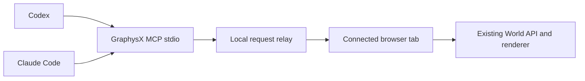

# GraphysX for Codex and Claude Code

Both clients use one local MCP adapter and the existing native World API. They can continue a connected browser world or prepare a separate editable scene without replacing the user's current tab. This does not need an AgentX model call.



There is one stdio process per client. Both address the same local relay and explicit browser connection IDs. The relay holds pending requests only; it does not mirror or store the world. The browser serializes delivery and checks the current revision before every mutation. Native validation, undo, storage and actor-attributed commits remain authoritative. Failed native operations are MCP errors, even when transport delivery succeeded. Uncertain dispatched timeouts are never retried automatically.

## Tools and context

| Tool | Purpose |
|---|---|
| `worlds` | Identify connected tabs, scene labels and revisions |
| `new_world` | Return a separate editor URL; the client opens it, then discovers its connection |
| `catalog` | Search the existing native tool catalogue on demand |
| `observe` | Compact summary, revision and at most 24 entities (`loaded: false` when the tab has no scene yet) |
| `read` | Native read-only methods, queried entities, assets, history and portable JSON |
| `edit` | Native mutating methods with a required observed revision |
| `camera` | Frame the actual main camera without changing scene content; `expectedRevision` is optional here |
| `capture` | Return a PNG from the renderer after its current frame, including the face inset |

The full argument reference is exposed as the MCP resource `graphysx://world-api`, read only when needed. A short shared [skill](../skills/graphysx/SKILL.md) guides both clients. This avoids loading the full world JSON and every asset catalogue into every conversation turn.

## Concurrency and failure semantics

- **Optimistic revisions, checked in the tab.** Every `edit` carries the revision the agent last observed; the tab compares it to the live revision at execution time and rejects a stale edit with `Revision conflict`. One poll loop serializes requests from MCP clients. Human UI edits still use the native API directly; this transport does not lock the UI during asynchronous native operations. Prefer native actor-attributed commits for related scene edits.
- **Timeouts are honest.** If the tab never picked a request up, the agent gets `World did not receive the request`. If the tab picked it up but did not answer within the relay's window (20 s), the agent gets `Response timed out; an edit may have applied` and must `observe` before deciding whether to retry.
- **The tab never silently disconnects.** The browser loop treats every relay failure as transient: a reply the relay no longer wants (after a timeout) is dropped and the loop keeps serving; a world the relay has forgotten (preview restarted, tab asleep past the 60 s stale sweep) is re-registered with a new id; anything else is retried with exponential backoff (1 s doubling to 30 s). Connection events are logged to the tab console as `[graphysx-agent] …`. After a reconnect the agent must call `worlds` again, because the world id changed.
- **Ids are per connection, not per scene.** A `worldId` from `worlds` is the tab's relay connection; the scene document id is inside `world`.
- **Page lifecycle is explicit.** `pagehide` stops admission and disconnects the tab. A late poll cannot start an edit after stop; an already-running native operation may still finish. A `pageshow` history-cache restore starts a new connection to the same scene. Calling a loop's `run()` twice shares one consumer.

## Local installation

The server is `tools/graphysx-mcp.mjs` (`npm run agent:mcp`). Its only new runtime packages are the official MIT MCP server SDK 2.0.0 and Zod. They run locally and do not call a paid API.

Set `GRAPHYSX_URL` to a loopback origin such as `http://127.0.0.1:4207/`. Two servers mount the relay:

- the built preview, `scripts/serve-llmx.mjs dist` (default port 4207). With an existing build, the first `worlds`/`new_world` call starts it if the port is absent; other calls do not blindly launch or replace servers. Set `GRAPHYSX_AUTOSTART=0` to disable this. `LLMX_HOUSEHOLD_URL` is optional and only preserves the existing conversation route when starting that preview;
- the Vite dev server, `npm run dev` (default port 4173), for working on GraphysX itself with an agent attached to the live tab: point `GRAPHYSX_URL` at the dev port and set `GRAPHYSX_AUTOSTART=0` so a missing dev server is reported instead of replaced by a `dist` preview on its port.

Public/LAN origins, foreign Host/Origin headers and non-JSON mutations are rejected by the relay. Browser attachment is opt-in through `agentBridge=1`; ordinary/public GraphysX visits make no relay request. Any local process can address a connected world through the relay (there is no per-agent credential; the token protects only the tab's own endpoints), which is the intended trust boundary for a loopback-only service.

Use the client's supported registration command with an absolute Node executable and script path:

```text
codex mcp add graphysx --env GRAPHYSX_URL=http://127.0.0.1:4207/ -- node /absolute/path/to/GraphysX-Web/tools/graphysx-mcp.mjs
claude mcp add --scope user --transport stdio graphysx -- node /absolute/path/to/GraphysX-Web/tools/graphysx-mcp.mjs
```

The shared skill source is `skills/graphysx`; installed paths are `~/.codex/skills/graphysx` and `~/.claude/skills/graphysx`. Existing sessions may need their MCP servers reloaded. Configuration follows the official [Codex MCP documentation](https://learn.chatgpt.com/docs/extend/mcp?surface=cli) and [Claude Code MCP documentation](https://code.claude.com/docs/en/mcp).

## Verification

Node tests (`node --test "test/graphysx-*.test.mjs"`, no browser, no model):

- `graphysx-mcp.test.mjs` — two standard MCP client processes: discovery, resource reads, input schemas, local-origin restrictions.
- `graphysx-agent-relay.test.mjs` — exact per-agent receipts, undelivered vs. dispatched timeouts, public/LAN and cross-origin rejection.
- `graphysx-agent-connection.test.mjs` — read/edit separation, stale revisions, native rejection, bounded camera values, the no-world case, at the tab boundary.
- `graphysx-agent-loop.test.mjs` — the tab loop survives a late reply, reconnects after a forgotten world, backs off on outages, rejects work after stop, releases a late registration and prevents duplicate consumers.
- `graphysx-mcp-e2e.test.mjs` — real stdio MCP clients through a real relay to the real tab loop over an in-memory world: two agents building one scene, a stale edit losing, a slow edit reported as uncertain with the tab still serving, and a relay restart with automatic reconnect.

Browser smoke (`scripts/smoke-agent-mcp.mjs`, registered as `agent-mcp` in the verification manifest): two clients edit, reject stale revisions, save/reload and reconnect after relay state is cleared against the actual renderer, with camera and PNG capture. It also dispatches history-cache lifecycle events twice to verify page restore listeners; it does not claim a real browser cache hit. Run it after any change to `src/graphysx-agent-connection.ts`; the Node tests cannot see the renderer.

Captures contain the 3D canvas, not HTML controls or conversation text. Named saves are browser-local; portable JSON must be exported explicitly when a project file is wanted. Publishing the browser build does not publish an MCP relay: the agent endpoint remains local to the operator's computer.

## Status notes (dated; move to the handoff when stale)

- 2026-09-14: On Yanik's Windows installation, both client registrations and both skill junctions reference the `GraphysX-Web-llmx-integration` checkout. Keep that checkout until the integration is merged and the registrations/junctions have been repointed. No tool approval policy was relaxed.
- 2026-09-14: Windows review in `GraphysX-Web-mcp-reconnect` passed 16 focused MCP tests, repository unit tests (559 passed, one pre-existing skip), typecheck, lint, build, physics probes and the expanded `agent-mcp` browser smoke. The real Vite server also served the relay and rejected a foreign origin. The rendered two-cube capture was inspected in `output/verify/world.png`. These are local validation receipts; production requires a successful deployment and matching public `release.json`.
